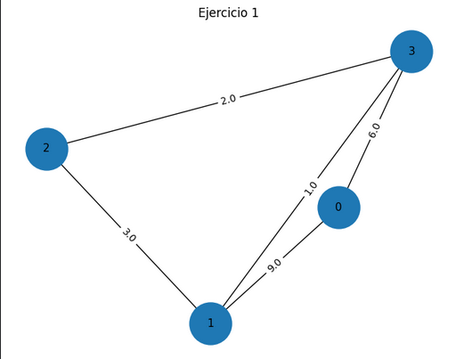

# Práctica 6

En esta práctica se trabaja con el algoritmo de Dijkstra, cuyo objetivo es encontrar los caminos más cortos en un grafo ponderado. A lo largo de los ejercicios, se implementa el algoritmo en Python y se aplica a distintas matrices de adyacencia que representan grafos dirigidos y no dirigidos.

Se parte de la construcción de una función general que recibe una matriz de pesos y un nodo inicial, y devuelve las distancias mínimas hacia todos los demás nodos junto con sus predecesores y posteriormente se utiliza esta información para reconstruir el camino óptimo entre dos vértices específicos.

Además, se extiende el análisis a múltiples grafos, calculando los caminos mínimos desde todos los nodos, lo cual nos permitirá comprender el comportamiento del algoritmo en diferentes estructuras. Finalmente, se incorporan herramientas como networkx y matplotlib para visualizar las gráficas, facilitando la interpretación de los resultados obtenidos.

## Integrantes

- García Chalche Julio César 
- Rodríguez Rodríguez Diego 

## Uso e instalación
Para poder ejecutar el código, primero debes instalar los siguientes archivos:
- `models.py`: Aquí encontrarás el algoritmo de Dijkstra.
- `main.py`: Contiene el código para graficar cada uno de los tres ejercicios
- `data.py`: Tal vez aquí puedes leer el csv para a partir crear una matriz de adyacencia

## Ejercicio 1
Planteamiento: 

    Programa una función que reciba la matriz de pesos de una gráfica y el nodo inicial y que 
    aplique el algoritmo de Dijkstra. Tu función debe regresar una lista con las distancias de las
    rutas y el origen de la arista con la que terminó la ruta.

Para resolver el Ejercicio 1, se implementó el algoritmo de Dijkstra, el cual permite encontrar las distancias mínimas desde un nodo origen hacia todos los demás nodos en un grafo ponderado.

El problema se modeló mediante una matriz de adyacencia, donde cada posición $(i, j)$ representa el peso de la arista del nodo $i$ al nodo $j$. En esta práctica, se consideró que un valor de 0 indica que no existe conexión directa entre los nodos.

La matriz utilizada fue la siguiente:

| Origen | Destino | Peso |
| :--- | :--- | :---: |
| Nodo 0 | Nodo 1 | 9 |
| Nodo 0 | Nodo 3 | 6 |
| Nodo 1 | Nodo 3 | 1 |
| Nodo 2 | Nodo 1 | 3 |
| Nodo 3 | Nodo 2 | 2 |

El algoritmo de Dijkstra se desarrolló siguiendo estos pasos:

Inicialización
Se asigna distancia 0 al nodo origen (nodo 0).
A los demás nodos se les asigna una distancia infinita (inf).
Se crea una lista de predecesores para reconstruir caminos.
Selección del nodo
Se selecciona el nodo no visitado con la menor distancia conocida.
Actualización de distancias
Se revisan los vecinos del nodo actual.
Si se encuentra un camino más corto, se actualiza la distancia y el predecesor.
Marcado como permanente
El nodo se marca como visitado (permanente).
Repetición
Se repiten los pasos anteriores hasta procesar todos los nodos. 

Aplicando el algoritmo desde el nodo 0, se obtuvieron las siguientes distancias mínimas:

| Nodo | Distancia | Predecesor |
| :--- | :---: | :--- |
| **0** | 0.0 | *None* |
| **1** | 9.0 | 0 |
| **2** | 8.0 | 3 |
| **3** | 6.0 | 0 |

<h3 align="center">Gráfica del ejercicio 1</h3>

  

## Ejercicio 2
Ahora, usando las listas generadas por tu función del algoritmo de Dijkstra, programa 
una función que encuentre el camino óptimo entre dos vértices.

## Ejercicio 3
Prueba tus funciones con las siguientes matrices de pesos, empezando siempre en el nodo 
0.
Nota : Donde encuentres un cero quiere decir que no existe una arista entre dichos vertices.

## Ejercicio 4
Encuentra la distancia mínima para el siguiente ejemplo , y organice el diagrama para tenerlo en Python.
(Screenshot_20260322_151336_Drive.jpg)

ETAPA 1

|Estados finales|Estados Iniciales (EI)|$F_1$|Qué estado inicial minimiza $F_1$?|
|------|--------|--------|-------|
|2|1|9|1|
|3|1|7|1|
|4|1|3|1|
|5|1|2|1|

ETAPA 2
|Estados finales|EI (2)|EI (3)|EI (4)|EI (5)|$F_2$|¿Qué estado inicial minimiza $F_2$?|
|---------------|------|------|------|------|-----|-----------------------------------|
|6              |1+4   | 7+2  |      |      |   5 |                                 2|
|7              |      |      |      | 2+11 |   13|5|
|8              | 9+1  |      |  3+11| 2+7  |    9|5|

ETAPA 3

|Estados finales|EI (6)|EI (7)|EI (8)|$F_3$|¿Qué estado inicial minimiza $F_3$?|
|---------------|------|------|------|-----|-----------------------------------|
|9              |5+6   | 13+4 |      |  11 |                                 6 |
|10             |5+5   | 13+4 |  9+5 |   10|6|
|11             |      |      | 2+7  |   15|8|

ETAPA 4

|Estados finales|EI (9)|EI (10)|EI (11)|$F_4$|¿Qué estado inicial minimiza $F_4$?|
|---------------|------|------|------|-----|-----------------------------------|
|12             |11+4  |10+6  |15+6  |  15 |                                 9 |

LA DISTANCIA MÍNIMA ESTÁ DADA POR EL SIGUIENTE CAMINO:
|ETAPA 1|ETAPA 2|ETAPA 3|ETAPA 4|
|-------|-------|-------|-------|
|(12)----(9)| (9)----(6)|(6)----(2)|(2)----(1) |

## Conclusión

¿Te gustó la programación dinámica? ¿Sientes que te será útil? ¿Se te hace una buena estrategia para la resolución de problemas?
